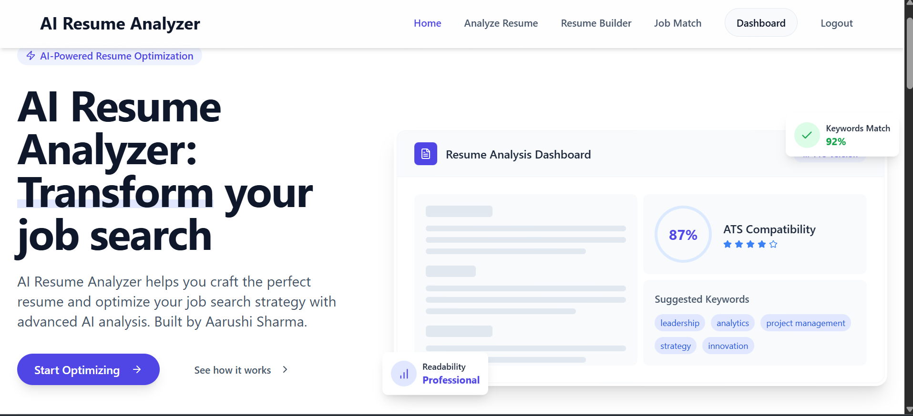
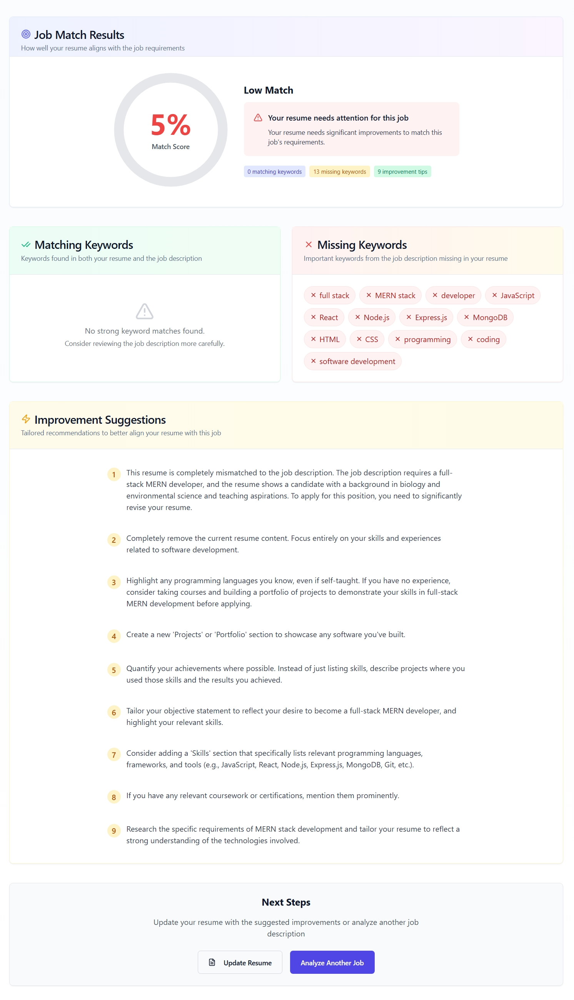
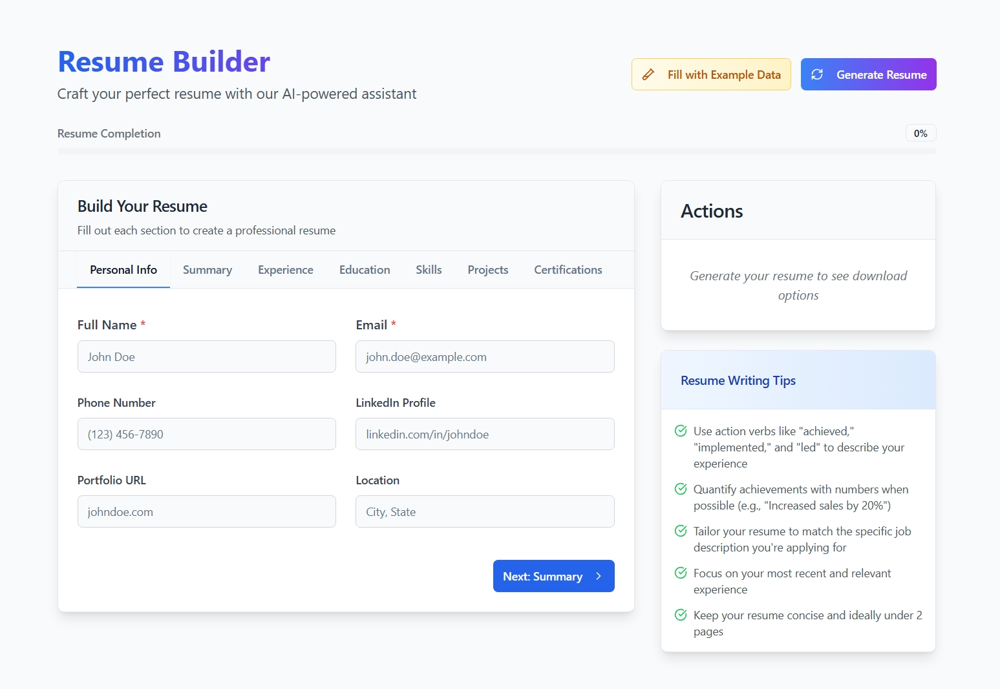

<div align="center">

# 🚀 AI Career Forge

### An AI-powered resume analysis and job matching platform

[](https://reactjs.org/)
[](https://www.typescriptlang.org/)
[](https://expressjs.com/)
[](https://firebase.google.com/)
[](https://tailwindcss.com/)
[](https://ai.google.dev/)

**AI Career Forge** helps job seekers build, analyze, and match resumes with job descriptions using Google Gemini AI — making resume optimization smarter and faster.

[Features](#-features) • [Tech Stack](#-tech-stack) • [Screenshots](#-screenshots) • [Getting Started](#-getting-started) • [API Endpoints](#-api-endpoints) • [Contact](#-contact)

</div>

---

## ✨ Features

- 🔐 **User Authentication** — Secure signup & login via Firebase Authentication
- 📄 **Resume Upload & Parsing** — Supports PDF and DOCX formats with automatic text extraction
- 🤖 **AI Resume Analysis** — ATS scoring, strengths, suggestions using Google Gemini API
- 🏗️ **AI Resume Builder** — Generate professional resumes from scratch with AI assistance
- 🎯 **Job Matching** — Compare your resume against any job description for match insights
- 💌 **Cover Letter Generator** — AI-powered personalized cover letters
- 📊 **User Dashboard** — Central hub to manage resumes, track scores, and access all features
- 💡 **Resume Tips** — General best practices and writing advice

---

## 🛠️ Tech Stack

### Frontend
| Technology | Purpose |
|---|---|
| React + Vite | UI framework & build tool |
| TypeScript | Type safety |
| Tailwind CSS | Styling |
| shadcn/ui | UI components |
| React Router DOM | Client-side routing |
| TanStack Query | Data fetching & caching |
| Axios | HTTP client |
| Firebase Client SDK | Authentication |

### Backend
| Technology | Purpose |
|---|---|
| Express.js | REST API server |
| TypeScript + Node.js | Runtime & type safety |
| Firebase Admin SDK | Server-side auth verification |
| Google Gemini API | AI resume analysis & generation |
| Firebase Firestore | NoSQL database |
| Multer | File upload handling |
| pdf-parse + Mammoth | PDF & DOCX parsing |

---

## 📸 Screenshots

> Add your screenshots here after capturing them from the running app

### Dashboard
<!-- Replace with your actual screenshot -->


### Resume Analysis
<!-- Replace with your actual screenshot -->
.png)

### Job Match
<!-- Replace with your actual screenshot -->


### Resume Builder
<!-- Replace with your actual screenshot -->


---

## 📁 Project Structure

```
AI-Career-Forge/
├── src/                          # Frontend source
│   ├── components/               # Reusable UI components (shadcn/ui)
│   ├── pages/                    # Page components
│   │   ├── dashboard/            # User dashboard
│   │   ├── AnalyzeResume.tsx     # Resume upload & analysis
│   │   ├── JobMatch.tsx          # Job description matching
│   │   └── ResumeBuilder.tsx     # AI resume builder
│   ├── lib/                      # API client, Firebase config
│   ├── context/                  # AuthContext (global auth state)
│   └── App.tsx                   # Routes & app entry
│
├── backend/
│   └── src/
│       ├── controllers/          # Business logic (resume, builder, match, auth)
│       ├── routes/               # API route definitions
│       ├── middleware/           # Firebase token verification
│       ├── config/               # Firebase Admin & Multer setup
│       ├── models/               # Firestore data schemas
│       └── server.ts             # Express server entry
│
├── .env                          # Frontend environment variables
└── backend/.env                  # Backend environment variables
```

---

## 🔄 User Workflow

```
Sign Up / Log In
      ↓
Upload Resume (PDF/DOCX)
      ↓
AI Analyzes → ATS Score + Suggestions
      ↓
Match Against Job Description
      ↓
Generate Cover Letter
      ↓
Build Improved Resume with AI
```

---

## 📡 API Endpoints

| Method | Endpoint | Auth | Description |
|--------|----------|------|-------------|
| POST | `/api/auth/signup` | ❌ | Register new user |
| POST | `/api/auth/login` | ❌ | Login user |
| GET | `/api/resumes` | ✅ | List uploaded resumes |
| POST | `/api/resumes/upload` | ✅ | Upload & parse resume |
| POST | `/api/resumes/:id/analyze` | ✅ | Trigger AI analysis |
| POST | `/api/builder/generate` | ✅ | Generate resume with AI |
| GET | `/api/builder/generated` | ✅ | List generated resumes |
| GET | `/api/builder/download/:id` | ✅ | Download generated resume |
| POST | `/api/match/resume-job` | ✅ | Match resume to job description |
| POST | `/api/cover-letter` | ✅ | Generate cover letter |
| GET | `/api/tips` | ❌ | Get resume writing tips |

---

## 🚀 Getting Started

### Prerequisites

- Node.js v18+
- Firebase project (Authentication + Firestore enabled)
- Google Gemini API key from [AI Studio](https://aistudio.google.com/app/apikey)

### 1. Clone the repository

```bash
git clone https://github.com/aarushhii30/AI-Resume-Analyzer.git
cd AI-Resume-Analyzer
```

### 2. Setup Frontend Environment

Create `.env` in the root folder:

```env
VITE_FIREBASE_API_KEY="your_firebase_api_key"
VITE_FIREBASE_AUTH_DOMAIN="your_project.firebaseapp.com"
VITE_FIREBASE_PROJECT_ID="your_project_id"
VITE_FIREBASE_STORAGE_BUCKET="your_project.firebasestorage.app"
VITE_FIREBASE_MESSAGING_SENDER_ID="your_sender_id"
VITE_FIREBASE_APP_ID="your_app_id"
VITE_API_BASE_URL="http://localhost:3000"
```

### 3. Setup Backend Environment

Create `backend/.env`:

```env
PORT=3000
GEMINI_API_KEY="your_gemini_api_key"
FRONTEND_URL="http://localhost:8080"
GOOGLE_APPLICATION_CREDENTIALS="./your-firebase-adminsdk.json"
```

> Place your Firebase service account JSON file inside the `backend/` folder.

### 4. Install Dependencies

```bash
# Frontend
npm install

# Backend
cd backend
npm install
```

### 5. Run the Project

```bash
# Terminal 1 — Backend
cd backend
npm run dev

# Terminal 2 — Frontend
npm run dev
```

Open `http://localhost:8080` in your browser.

---

## 🔥 Firebase Setup

1. Go to [Firebase Console](https://console.firebase.google.com)
2. Create a new project
3. Enable **Authentication** → Email/Password
4. Enable **Firestore Database** → Start in test mode
5. Go to **Project Settings** → Service Accounts → Generate new private key
6. Place the downloaded JSON in `backend/`

---

## 📄 License

This project is licensed under the [MIT License](LICENSE).

---

## 📬 Contact

**Aarushi Sharma**

[](https://github.com/aarushhii30)
[](https://linkedin.com/in/aarushhiisharma)
[](mailto:aarushhisharma@gmail.com)

---

<div align="center">
Made with ❤️ by Aarushi Sharma
</div>
